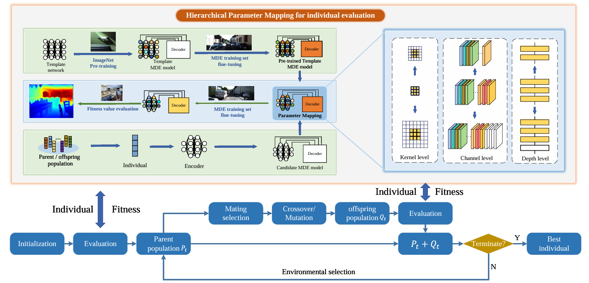
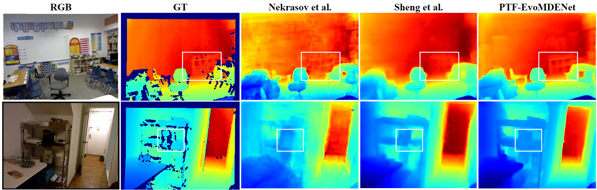

# PTF-EvoMDE 


<div align="center">
  
</div>

PTF-EvoMDE is an efficient NAS framework for monocular depth estimation. It eliminates the need for per-candidate pretraining by introducing hierarchical parameter mapping (HPM), and enhances depth prediction with a lightweight, feature-aligned CRFs decoder. PTF-EvoMDE achieves competitive performance on KITTI and NYUv2 with significantly reduced computation and strong transferability to detection and segmentation tasks.

## Requirements

- Base environment: `CUDA 11.8`
- Tested on: Python 3.8, PyTorch 2.1.2

```
# conda
conda create -n PTF-EvoMDE python=3.8 
conda activate PTF-EvoMDE
conda install pytorch==2.1.2 torchvision==0.16.2 torchaudio==2.1.2 pytorch-cuda=11.8 -c pytorch -c nvidia

# pip
pip install cython tqdm einops fvcore mmcv==0.2.10 timm==0.4.12

# setup
sh ./mmdet_build.sh
cd DCNv2_latest && python3 setup.py build develop
```

## Datasets

You can prepare the datasets [NYUv2](https://cs.nyu.edu/~fergus/datasets/nyu_depth_v2.html) and [KITTI](https://www.cvlibs.net/datasets/kitti/eval_depth.php?benchmark=depth_prediction) following the instructions provided in their official websites, and download the [synthetic data](http://cmic.cs.ucl.ac.uk/ColonoscopyDepth/) for Colonoscopy depth estimation. After downloading, please modify the data_path fields in the config files to match your local dataset locations.


## Searching & Training
Coming soon.


## Evaluation
Evaluate the searched models with the following scripts:

- **NYUv2**

```
sh scripts/test/nyu_test.sh
```

- **KITTI**

```
sh scripts/test/kitti_test.sh
```

- **Colonoscopy (Synthetic)**

```
sh scripts/test/colon_test.sh
```


## Models
| Model | Params.| Abs Rel | Sq Rel | RMSE | RMSE log | a1 | a2 | a3| 
| :--- | :---: | :---: | :---: |  :---: |  :---: |  :---: |  :---: |  :---: |
|[NYUv2](https://virutalbuy-public.oss-cn-hangzhou.aliyuncs.com/share/newcrfs/models/model_nyu.ckpt) | 6.13 | 0.1108 | 0.0675 | 0.4003 | 0.1448 | 0.8769 | 0.9775 | 0.9947  |
|[KITTI_Eigen](https://virutalbuy-public.oss-cn-hangzhou.aliyuncs.com/share/newcrfs/models/model_kittieigen.ckpt) | 6.26 | 0.0621 | 0.2173 | 2.5566 | 0.0954 | 0.9578 | 0.9943 | 0.9988 |

| Model | Params.| Mean L1-error  | Mean Relative L1-error  | Mean RMSE | a05 |
| :--- | :---: | :---: | :---: |  :---: |  :---: | 
|[Colon](https://virutalbuy-public.oss-cn-hangzhou.aliyuncs.com/share/newcrfs/models/model_nyu.ckpt) | 6.26 | 0.1397 | 0.0543 | 0.2306 | 0.8919 |


## NYUv2 Quantitative Comparison

<div align="center">
  
</div>

